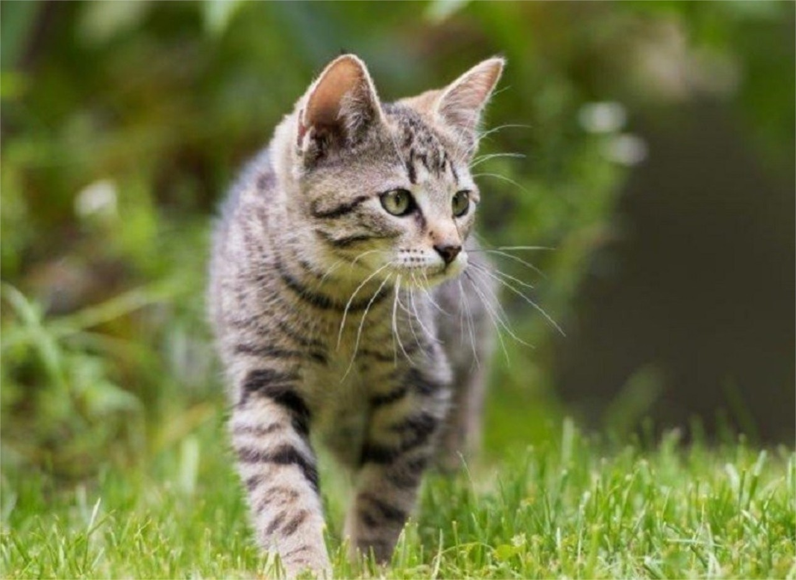

# Readme

## Images





## Code

```JS
let str = '';

for (let i = 0; i < 9; i++) {
  str = str + i;
}

console.log(str);
```

[Source](https://developer.mozilla.org/fr/docs/Web/JavaScript/Reference/Statements/for)

[Markdown](./markdown.md)
